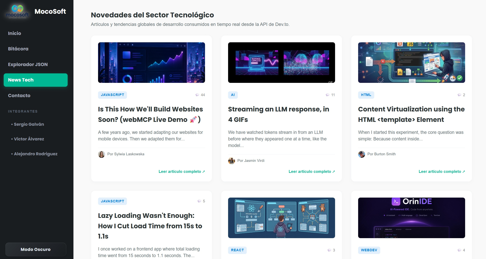
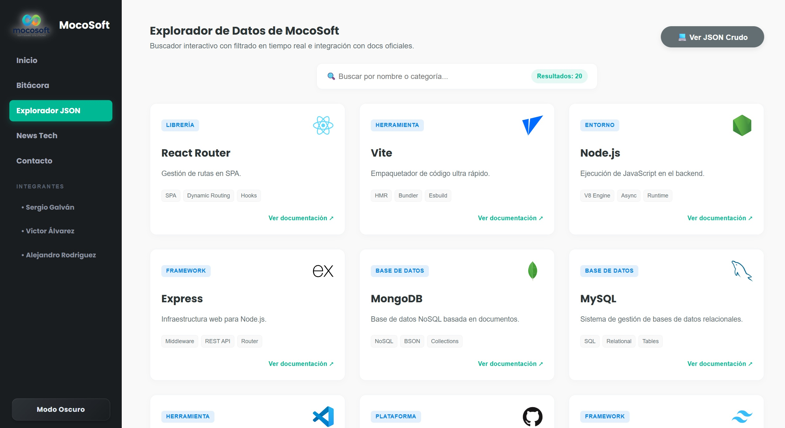
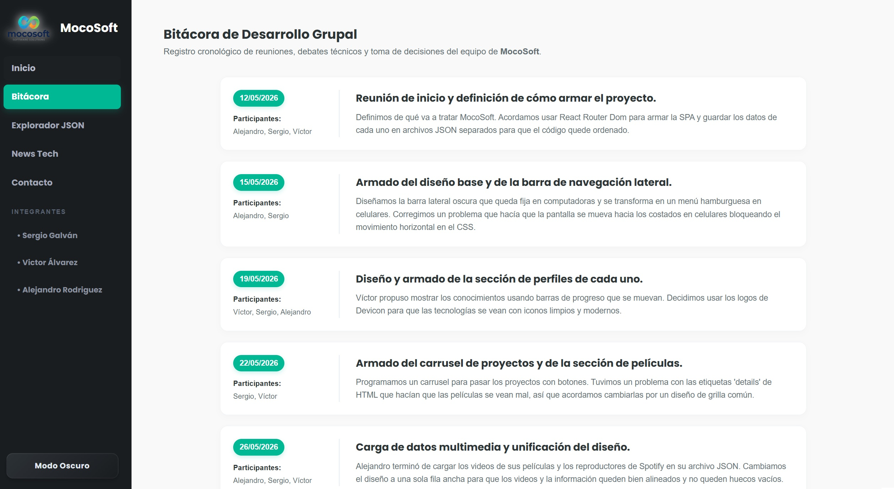

# MocoSoft - Plataforma de Gestión e Innovación Digital 🚀

## Información del Proyecto
* **Institución:** IFTS N°29
* **Carrera:** Tecnicatura Superior en Desarrollo de Software
* **Materia:** Desarrollo Web Frontend
* **Trabajo Práctico:** TP N°2 - Proyecto React
* **Equipo:** MocoSoft
* **Año:** 2026

---

## Integrantes del Equipo
* **Sergio Daniel Galván**
* **Victor Álvarez**
* **Alejandro Sebastian Rodriguez**

---

## Descripción General
Este proyecto consiste en el diseño y desarrollo desde cero de la plataforma web institucional de **MocoSoft**, estructurada como una Single Page Application (SPA) de alto rendimiento utilizando **React 18** y **Vite** como entorno de construcción rápido.

La interfaz fue concebida de forma nativa bajo el paradigma de un Dashboard Centralizado de Producción. El flujo de navegación se gestiona mediante un componente persistente de barra lateral (*Sidebar*) acoplado al sistema de enrutamiento interno de la aplicación. Al gestionar todo el ciclo de vida y el renderizado del lado del cliente, se elimina por completo la recarga tradicional de páginas, logrando una experiencia de usuario (UX) ágil, interactiva y reactiva.

---

## Características e Interactividad de la Interfaz (UX/UI)

* **Modo Oscuro Integral Controlado:** Conmutador global reactivo que inyecta la clase `dark-theme` directamente en la raíz del DOM (`document.body`). Controla la inversión de variables hexadecimales en hojas de estilo, modificando tarjetas, bloques de código, textos, logos con sombras y bordes sincrónicamente.
* **Navegación Móvil Flotante Slide-In:** El diseño de la Sidebar vertical se adaptó para dispositivos móviles mediante media-queries avanzados. En celulares, el menú permanece oculto en coordenadas negativas (`left: -260px`) y se desliza con una transición lineal suave hacia el centro al activar el botón hamburguesa (`☰`), respetando la consigna estricta de diseño vertical rígido.
* **Scroll Automático Automatizado:** Inclusión del componente inteligente `ScrollToTop` que, mediante hooks de geolocalización de rutas (`useLocation`) y temporizadores de renderizado, reinicia la posición vertical de la caja `.dashboard-content` a cero en cada navegación.
* **Manejo Consistente:** En todas las páginas se encuentra un botón sólido secundario de retorno directo al Inicio del Dashboard.
* **Pausa Inteligente por Hover:** El bucle de reproducción automática del carrusel de proyectos detiene sus temporizadores activos en el momento en que el cursor intercepta el área de lectura de una tarjeta, reanudando la iteración al retirar el mismo para no interrumpir al usuario.
* **Infinite Logo Slider:** Carrusel infinito automatizado en el footer de la Home mediante animaciones CSS (`@keyframes`) optimizado para el despliegue fluido de marcas corporativas que confían en la empresa.

---

## Capturas de Pantalla e Integración de Estructuras de Datos

Para garantizar la mantenibilidad del código y seguir las buenas prácticas de una arquitectura desacoplada, **toda la capa de información de la aplicación se separó de la lógica visual utilizando archivos en formato JSON** (`alejandro.json`, `sergio.json`, `victor.json`, `data.json` y `bitacora.json`).

De este modo, componentes clave como la vista de perfiles (`Perfil.jsx`) o el catálogo de herramientas reutilizan una única estructura lógica, inyectando los datos de forma asíncrona según los parámetros de la URL, emulando con precisión el comportamiento de un entorno profesional conectado a servicios de bases de datos o APIs.

### 1. Panel de Inicio (Dashboard General)

* **Referencia:** `dashboard.jpg`
* **Arquitectura de la Home:** Se implementó una distribución elástica integrada mediante la clase `.profile-section-block` que alinea de forma simétrica el banner de bienvenida, la tarjeta elástica de "Quiénes Somos" con logo responsivo agrandado (con efecto de destello *drop-shadow* blanco), el mapa y la grilla de presentación del equipo.
* **Componentes Reactivos:** El bloque informativo utiliza estados locales para controlar dinámicamente la visibilidad del propósito corporativo ("Conocer/Ocultar Propósito") mediante transiciones suaves en CSS.

### 2. Estructuración Multimedia y Colecciones de Perfil


* **Referencia:** `peliculas.jpg` y `discos.jpg`
* **Estructura Cinemática:** Diseñado de forma nativa en React para evitar elementos HTML rígidos que bloqueen la accesibilidad. Las colecciones se organizan en bloques de fila única de alto contraste, donde los textos jerárquicos conviven de forma prolija con reproductores multimedia embebidos de YouTube y Spotify.

### 3. Máscaras de Capas y Efecto Destello Circular

* **Referencia:** `destello.jpg`
* **Estilizado UI:** Para implementar el efecto interactivo de destello lumínico (*Shiny Glow*), se aplicó una máscara radial mediante la propiedad `mask-image` junto con sus prefijos Webkit. Esto confinó vectorialmente el haz de luz dentro de los límites del avatar circular sin fugas en las esquinas.

### 4. Animación del Carrusel de Proyectos

* **Referencia:** `deslizamiento.jpg`
* **Lógica del Componente:** Desarrollado utilizando el hook `useState` combinado con temporizadores automáticos para gestionar el carrusel. En lugar de transiciones secas, los proyectos realizan un desplazamiento lateral continuo acelerado por hardware en el eje X.

### 5. Consumo de API Externa: Noticias Tecnológicas (Dev.to)

* **Referencia:** `noticias.jpg`
* **Integración asíncrona:** Se programó el componente `ApiNoticias.jsx` para conectarse en tiempo real a la API pública de la comunidad Dev.to.
* **Control de Ciclos:** El flujo implementa de forma robusta el "tridente de estados de React" (Cargando / Éxito / Error de servidor) asegurando la estabilidad y el feedback visual de la interfaz ante microcortes de red o latencia.

### 6. Explorador de Datos Indexado con Minitags

* **Referencia:** `explorador.jpg`
* **Control UI:** Optimización de la grilla principal mediante tarjetas de altura compacta (`min-height: 260px`) y escalado de logotipos oficiales de Devicon a `45px` con zoom responsivo en hover.
* **Mapeo Anidado:** Para enriquecer la interfaz, el componente realiza un doble mapa interactivo, inyectando un array de `"tags"` embebido en el JSON para dibujar microetiquetas técnicas individuales por cada tecnología indexada.

### 7. Bitácora de Desarrollo 

* **Referencia:** `bitacora.jpg`
* **Maquetación Moderna:** Se diseñó un sistema elástico centrado de tarjetas flotantes cronológicas (`.bitacora-timeline`) acoplado al archivo de registro del equipo. Cuenta con márgenes dinámicos autoajustables y soporte completo para modo oscuro.

### 8. Formulario de Contacto Funcional (Formspree SDK)

* **Referencia:** `formulario.jpg`
* **Conexión Externa:** Integración directa con la librería `@formspree/react` para conectar los campos de entrada a un endpoint seguro de correos. Los estados de carga ("Enviando...") y las vistas de éxito se manejan de forma nativa por el estado del hook del servicio.

---

## Tecnologías Utilizadas
* **React 18** & **Vite**: Entorno de desarrollo ágil con recarga modular rápida (HMR).
* **React Router Dom (v6)**: Motor de enrutamiento del lado del cliente y segmentación dinámica de rutas (`/perfil/:id`).
* **React Hooks (`useState`, `useEffect`, `useRef`)**: Gestión de ciclo de vida, persistencia de referencias sin re-renderizado y manipulación segura del árbol del DOM.
* **SDK Formspree (`@formspree/react`)**: Procesamiento asíncrono y control nativo del estado de sumisión de formularios de contacto.
* **CSS3 Técnico Avanzado**: Hoja de estilos `index.css` unificada estructurada mediante variables CSS (`:root`), Flexbox elástico, corte de desbordamientos laterales (`overflow-x: hidden`) y CSS Grid con funciones de ajuste automático (`auto-fill`, `minmax`).

---

## Declaración de Uso de Inteligencia Artificial (Copiloto Técnico)

El equipo de **MocoSoft** integró de forma estratégica el uso de **Inteligencia Artificial**, seleccionando a **Gemini** como copiloto de desarrollo. Su implementación se acotó exclusivamente a la optimización de procesos operativos, la resolución de problemas de compatibilidad y la estandarización arquitectónica de las hojas de estilo, acelerando los tiempos de entrega sin delegar la lógica de negocio ni el diseño de componentes.

### Tareas Específicas de Asistencia Técnica:

1. **Refactorización de Estilos y Deuda Técnica (Clean Code):** Se utilizó la IA para auditar y estructurar el archivo global `index.css`. Nos asistió en la unificación y corrección de la sección de soporte de Modo Oscuro, vinculando de forma sutil elementos que presentaban fallas de contraste (`.seccion-empresas-titulo`, `footer`, y los textos de `.profile-section-block`).
2. **Cálculo de Coordenadas, Animaciones y Transiciones Fluidas:** Soporte técnico en la sincronización de tiempos en milisegundos para las transiciones del carrusel de proyectos y el feed de noticias. Asimismo, colaboró en el diseño de la lógica de coordenadas negativas (`left: -260px`) para el comportamiento elástico del Sidebar responsive y en el cálculo elástico de márgenes porcentuales (`padding: 0 5%`) en teléfonos móviles.
3. **Compatibilidad Multiplataforma (Cross-Browsing & Vendor Prefixes):** Validación de reglas de renderizado específicas para motores Webkit (Chrome/Safari) y Gecko (Firefox). Esto garantizó la correcta aplicación de propiedades complejas, como las máscaras radiales (`mask-image`) utilizadas para los avatares y filtros tipo `drop-shadow` para los componentes de logotipos transparentes.

El uso de Gemini se limitó estrictamente a la asistencia técnica y optimización de código. Toda la arquitectura modular de React, la gestión del estado global (Modo Oscuro, lógica de filtrado del Explorador), el sistema de enrutamiento dinámico, el control del ciclo de desborde y el modelado de los datos locales en formato JSON fueron diseñados, codificados y validados íntegramente por los ingenieros de MocoSoft.

---

## Estructura del Proyecto

```text
src/
├── components/
│   ├── Card.jsx           # Renderizador de tarjetas de integrantes en Home
│   ├── Sidebar.jsx        # Navegación vertical interactiva y control responsive
│   ├── ScrollToTop.jsx    # Reset de scroll asíncrono temporizado por cambio de ruta
│   └── ToggleButton.jsx   # Switch dinámico de mutación de temas (Light/Dark)
├── data/
│   ├── data.json          # Datos de tecnologías y características (Explorador)
│   ├── bitacora.json      # Registro evolutivo de actividades del equipo
│   ├── marcas.json        # Colección de logotipos corporativos para el slider
│   ├── alejandro.json     # Estructura profesional de Alejandro
│   ├── sergio.json        # Estructura profesional de Sergio
│   └── victor.json        # Estructura profesional de Víctor
├── pages/
│   ├── Home.jsx           # Panel raíz de presentación institucional y Quiénes Somos
│   ├── Perfil.jsx         # Vista dinámica paramétrica de perfiles de integrantes
│   ├── Explorador.jsx     # Buscador indexado con filtrado en tiempo real
│   ├── Bitacora.jsx       # Componente de línea de tiempo con diseño elástico
│   └── ApiNoticias.jsx    # Consumo y renderizado asíncrono de API de Dev.to
├── App.jsx                # Enrutador troncal, estados de tema y Layout estructural
├── main.jsx               # Hilo de entrada y montaje sobre el contenedor root
└── index.css              # Hoja de estilos globales unificada y optimizada