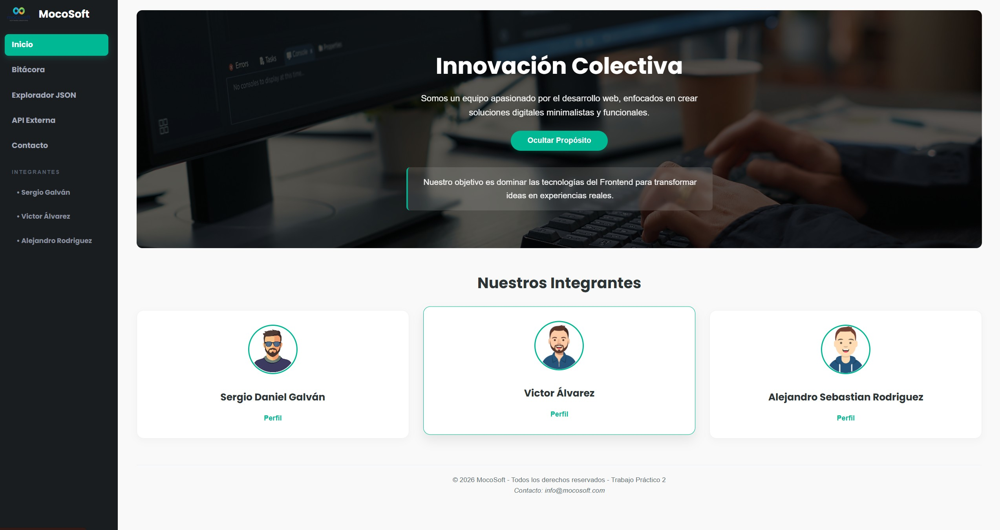
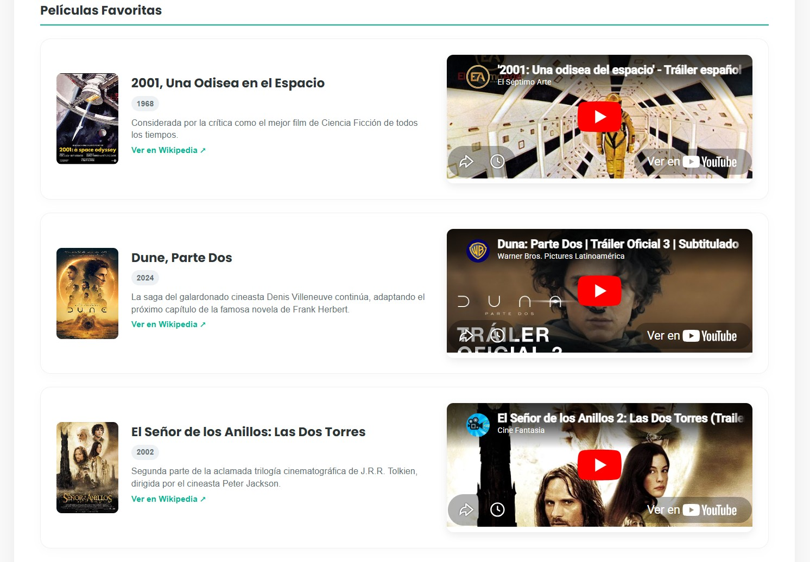
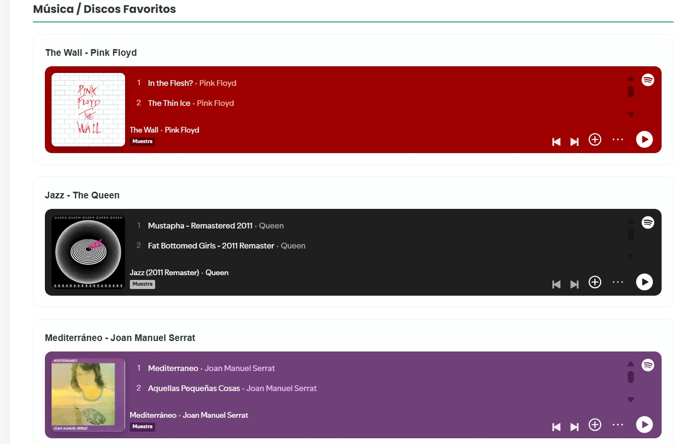
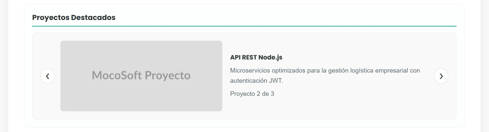
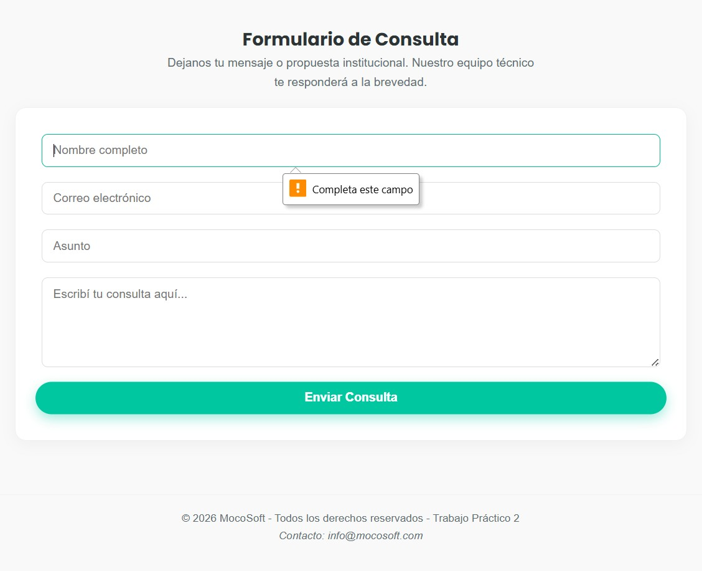

# MocoSoft - Dashboard de Innovación Colectiva

## Información del Proyecto
* **Institución:** IFTS N°29
* **Carrera:** Tecnicatura Superior en Desarrollo de Software
* **Materia:** Desarrollo Web Frontend
* **Trabajo Práctico:** TP N°2 - Migración a Single Page Application (SPA) con React
* **Equipo:** MocoSoft
* **Año:** 2026

---

## Integrantes del Equipo
* **Sergio Daniel Galván** - *Full Stack Developer*
* **Victor Álvarez** - *Frontend Specialist*
* **Alejandro Sebastian Rodriguez** - *Software & Logic Developer / Gestión de Rutas*

---

## Descripción General
Este proyecto representa la evolución tecnológica de la plataforma institucional de **MocoSoft**. Tomando como base la estructura estática tradicional (HTML, CSS y JavaScript Vanilla) desarrollada en el TP1, se ejecutó una migración integral hacia una **Single Page Application (SPA)** utilizando **React** y **Vite**. 

La interfaz se rediseñó bajo una arquitectura de **Dashboard centralizado**, donde la navegación se rige por una barra lateral (*Sidebar*) fija y los contenidos se renderizan de forma dinámica, optimizando la transferencia de datos y la fluidez de la experiencia de usuario (UX).

---

## Screenshots y Estructuración de Datos (JSON)

Para lograr un sistema verdaderamente escalable y desacoplado del código fuente, el equipo tomó la decisión de **diseñar y estructurar bases de datos locales utilizando archivos independientes en formato JSON** para cada uno de los integrantes (`alejandro.json`, `sergio.json` y `victor.json`). 

Este enfoque de persistencia de datos del lado del cliente permitió que la vista dinámica `Perfil.jsx` actúe como un cascarón genérico que consume e inyecta la información de forma paramétrica según el ID de la URL (`/perfil/:id`), emulando el comportamiento de un entorno de producción real.

A continuación, se detallan los hitos del desarrollo y el pulido de la interfaz a través de las capturas de pantalla de la aplicación:

### 1. Panel de Inicio (Dashboard General)
* **Captura de referencia:** 
* **Detalle del trabajo:** Implementación del layout central adaptativo. Se corrigió un error crítico de encogimiento visual que comprimía el contenedor hacia el centro, logrando que el banner principal de *Innovación Colectiva* y la grilla de accesos directos a los integrantes ocupen el 100% del ancho fluido disponible en la pantalla.
* **Componente restaurado:** Se repararon de raíz los estilos del botón interactivo del Hero ("Conocer/Ocultar Propósito"), transformándolo en una píldora ergonómica con efectos hover de elevación.

### 2. Rediseño Multimedia y Grilla Cinematográfica
* **Captura de referencia:**


* **Detalle del trabajo:** Se removió el elemento nativo HTML `<details>` que generaba graves problemas de contraste en modo oscuro (volviendo invisibles los títulos) y rompía la simetría al abrirse de forma asíncrona.
* **Resultado final:** Las películas y álbumes se migraron a un formato *wide* de una sola columna. Los títulos se forzaron a blanco puro (`#ffffff`) y las sinopsis a un gris plata ultra legible (`#cbd5e1`), garantizando un contraste óptimo. Los iFrames de YouTube y Spotify quedaron perfectamente alineados.

### 3. Máscaras de Recorte y Efectos de Vanguardia
* **Captura de referencia:** 
* **Detalle del trabajo:** Corrección de fugas de brillo en los avatares de los integrantes. Para evitar que el haz de luz del efecto *Shiny Glow* se viera cuadrado en las esquinas de las fotos redondas, se aplicó la propiedad estándar `mask-image: radial-gradient(white, black);` junto con su prefijo `-webkit-`, logrando que el destello se autoguarde estrictamente dentro del borde circular de la foto.


### 4. Animación Física en Carrusel de Proyectos
* **Captura de referencia:** 
* **Detalle del trabajo:** Se eliminó el cambio en seco de las diapositivas. Mediante la coordinación de estados reactivos en React (`useState`) y temporizadores enlazados con transiciones CSS (`translateX`), los proyectos ahora realizan un efecto de empuje lateral fluido (`slide-enter` / `slide-exit`) imitando un comportamiento táctil orgánico.

### 5. Sanitización de Formularios y Botonera Global
* **Captura de referencia:** 
* **Detalle del trabajo:** Eliminación de botones nativos rotos. El botón "Enviar Consulta" del módulo de Contacto, el botón de peticiones en "API Externa" y el botón "← Volver al Dashboard" de la vista de perfiles fueron despojados de estilos en línea (*hardcodeados*) planos y grises. 
* **Resultado final:** Se unificaron bajo las clases `.btn-primary` y `.btn-secondary`, convirtiéndose en elementos redondeados modernos con transiciones de color sutiles y adaptadas al modo nocturno.

---

## ✨ Características e Interactividad de Vanguardia (UX/UI)

El sistema integra componentes interactivos avanzados desarrollados de forma nativa mediante lógica reactiva y transiciones físicas aceleradas por hardware:

* **Modo Oscuro Integral Controlado:** Conmutador global modular (`ToggleButton`) comandado por estados y efectos de React que inyecta una paleta de grises mate premium en el `body`, garantizando alto contraste y legibilidad absoluta en pantallas multimedia.
* **Carrusel de Proyectos Automatizado e Inteligente:** Rotación automática de diapositivas cada 4 segundos provista de un sistema de interrupción por eventos (`onMouseEnter` / `onMouseLeave`) que congela el temporizador para no interrumpir la lectura del usuario.
* **Animación de Deslizamiento Horizontal (Slide Effect):** Transición física mediante clases dinámicas (`slide-enter` / `slide-exit`) y transformaciones tridimensionales en el eje X para emular un comportamiento táctil fluido al cambiar de slide.
* **Efecto Destello ("Shiny Glow Effect"):** Animación interactiva basada en un degradado lineal oblicuo que cruza el avatar de los integrantes al pasar el cursor. Se aplicaron máscaras radiales estrictas (`mask-image`) para garantizar que el haz de luz se recorte de forma limpia y simétrica dentro de la circunferencia.
* **Disposición Multimedia Unificada:** Maquetación cinematográfica horizontal en una sola columna para trailers y listas de reproducción que neutraliza baches visuales y balancea la interfaz responsiva.

---

## Tecnologías y Arquitectura Utilizadas
* **React 18** & **Vite**: Entorno de desarrollo y empaquetamiento ultra rápido.
* **React Router Dom (v6)**: Implementación de enrutamiento jerárquico y parámetros dinámicos en URL (`/perfil/:id`).
* **React Hooks (`useState`, `useEffect`, `useRef`)**: Gestión de estados mutables locales, persistencia de timers e inyección dinámica de dependencias como Devicon CDN.
* **CSS3 Avanzado**: Unificación de hojas de estilo mediante variables de diseño `:root`, Flexbox, CSS Grid y optimización de rendimiento gráfico (`will-change`).

---

## 🤖 Declaración de Uso de Inteligencia Artificial

En **MocoSoft** adoptamos las herramientas de desarrollo más vanguardistas del ecosistema de software. Por lo tanto, este proyecto integró el uso de **Inteligencia Artificial (IA Generativa)** como un copiloto de programación y aseguramiento de calidad (QA).

### Áreas clave de soporte de la IA:
1.  **Refactorización y Arquitectura CSS:** Asistencia en la consolidación y auditoría estructural del archivo global `index.css`, permitiendo separar la lógica de estilos en bloques ordenados y escalables.
2.  **Sincronización de Estados de Animación:** Co-pilotaje en el diseño del desfasaje por milisegundos (`setTimeout`) necesario para coordinar los ciclos de vida de entrada y salida del carrusel animado.
3.  **Garantía de Compatibilidad entre Navegadores:** Resolución de advertencias (*warnings*) de VS Code mediante la adición de propiedades CSS estándar en convivencia con prefijos específicos de motores de renderizado (`-webkit-line-clamp` y `-webkit-mask-image`).

> **Nota institucional:** La IA actuó como un recurso complementario de asistencia técnica. Las decisiones de diseño estético, la abstracción de componentes, la modularización de las vistas y la diagramación de las bases de datos JSON fueron planificadas, controladas y validadas con criterio profesional propio por los desarrolladores del equipo.

---

## Estructura del Proyecto (Eje de Componentes)
La aplicación se organizó bajo criterios de modularidad y reutilización de código:
```text
src/
├── components/
│   ├── Card.jsx          # Componente reutilizable para la grilla de integrantes
│   ├── Sidebar.jsx       # Eje estructural de navegación del Dashboard
│   └── ToggleButton.jsx  # Componente aislado para la conmutación de interfaces lumínicas
├── data/
│   ├── data.json         # Base de datos local (20 objetos de tecnologías)
│   ├── bitacora.json     # Historial cronológico detallado de acuerdos grupales
│   ├── alejandro.json    # Modelo de datos profesionales de Alejandro
│   ├── sergio.json       # Modelo de datos profesionales de Sergio
│   └── victor.json       # Modelo de datos profesionales de Víctor
├── pages/
│   ├── Home.jsx          # Panel central de presentación del equipo
│   ├── Perfil.jsx        # Vista dinámica, multimedia y paramétrica de perfiles profesionales
│   ├── Explorador.jsx    # Motor de búsqueda local con filtrado reactivo
│   ├── Bitacora.jsx      # Documentación y fundamentación técnica de la migración
│   └── ApiExterna.jsx    # Módulo de consumo asíncrono (API de GitHub)
├── App.jsx               # Enrutador central y Layout general del Dashboard
├── main.jsx              # Punto de entrada de la aplicación
└── index.css             # Estilos globales, ordenados e integrados del sistema